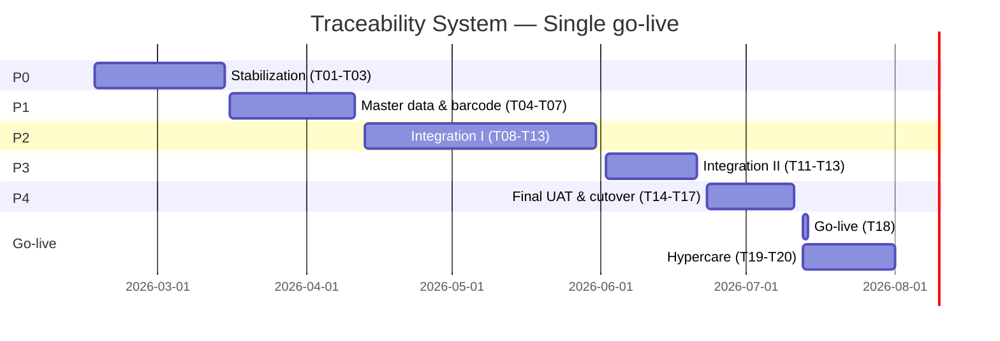

# Program Gantt and progress tracker (single go-live)

Baseline: **2026-02-16**  
Target go-live: **2026-07-13**  
Project closure: **2026-07-31**

Task IDs map to [project/roadmap.md](../project/roadmap.md) (T01–T20).  
As of **2026-02-16** (from [project/checklist.md](../project/checklist.md)): 140 items tracked, 98 done, 36 in progress, 6 not started. Strict completion 70.0%, weighted 82.9%.

Program phase: **P0 – Stabilization**. Go-live state: **Not ready** (UAT/cutover/sign-off pending).

---

## Gantt (phases)

---

## Weekly tracker (sample)

| Week starting | Phase | Focus tasks   | Check result    |
| ------------- | ----- | ------------- | --------------- |
| 2026-02-16    | P0    | T01, T02, T03 | `bun run check` |
| 2026-02-23    | P0    | T01–T03       | `bun run check` |
| …             | …     | Update weekly | …               |

---

## Milestone checklist

- [ ] P0 complete: UX stable, timezone validated
- [ ] P1 complete: Master data and barcode governance done
- [ ] P2 complete: Material flow UI + UAT cycle 1 + offline handling
- [ ] P3 complete: Trace and genealogy verified
- [ ] P4 complete: Final UAT passed, sign-off, cutover rehearsal
- [ ] Go-live: T18 executed, hypercare T19–T20

---

For the full Gantt mermaid, weekly tracker table, monthly rollup, and milestone checklist, see above and [execution-board.md](execution-board.md). Update this file and [execution-board.md](execution-board.md) every Friday checkpoint.

Required weekly evidence:

- Updated [execution-board.md](execution-board.md)
- This Gantt tracker (weekly row)
- `bun run check` and (from June onward) `bun run check:go-live`
